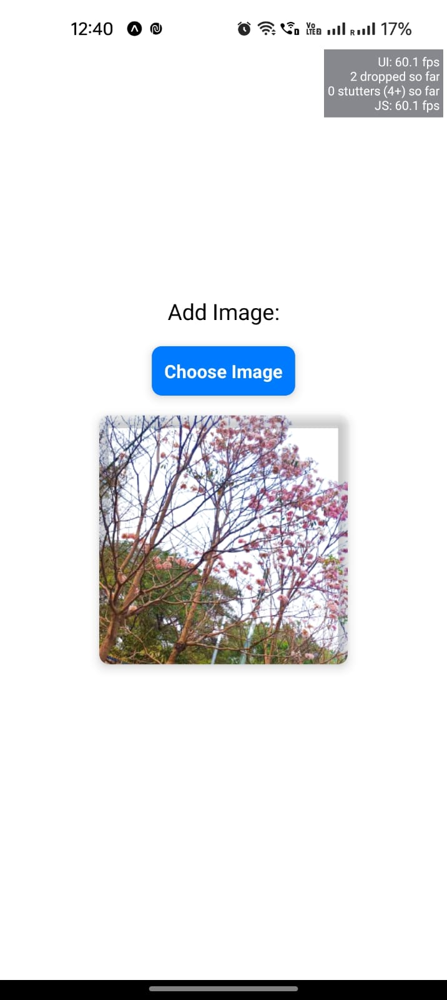

# Image Uploader App

This is a simple React Native app that allows users to choose an image from their device's gallery and upload it to a backend server and return it to them after removing the background.

## Features

- Choose an image from the device's gallery.
- Upload the selected image to a backend server.

## Prerequisites

- [React Native](https://reactnative.dev/)
- [Expo](https://expo.dev/)
- Expo Go app installed on your mobile device ([iOS](https://apps.apple.com/us/app/expo-go/id982107779) / [Android](https://play.google.com/store/apps/details?id=host.exp.exponent))

## Getting Started

1. Clone this repository.
2. Navigate to the project directory.
3. Install dependencies by running `npm install`.
4. Start the development server with `expo start`.
5. Open the Expo Go app on your mobile device.
6. Scan the QR code displayed in the terminal or in the Expo Dev Tools in your browser.

## Usage

- Upon launching the app, you will see a "Choose Image" button.
- Tap the button to open the device's gallery and select an image.
- The selected image will be displayed on the screen.
- The app will attempt to upload the image to the specified backend server.
- If the upload is successful, the uploaded image will replace the selected image on the screen.
- Additionally, the uploaded image will be downloaded and saved to the device's camera roll.

## Dependencies

- React
- React Native
- Expo
- expo-image-picker
- expo-file-system
- expo-media-library

## Screenshots

## <a href="https://github.com/ananya26-vishnoi/background-removal-backend.git">Backend Link</a>
